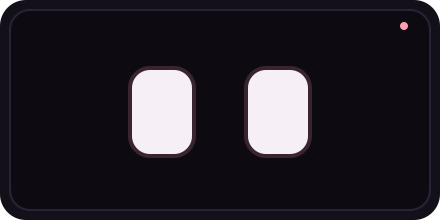
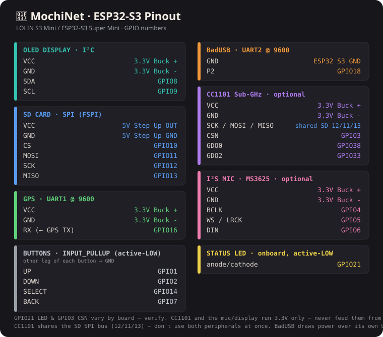

<p align="center">
  
</p>

## MochiNet 🐷 — ESP32-S3 WiFi/BLE/RF security companion

> **ALPHA** — this is an early release. Expect rough edges. Flashing, OTA, and the
> core tools work, but features are still landing and APIs may change.

MochiNet is a handheld WiFi / BLE / sub-GHz security toolkit with a virtual-pet UI.
Mochi lives on the screen, reacts to what the tools are doing, and **freaks out when a
surveillance device is detected nearby**. It also acts as the **Core** for a mesh of
ESP32-C5 "Piglet" wardriving nodes, so one device with GPS collects what a whole flock
of radios sees — including the 5 GHz bands the S3 can't scan itself.

## ⚠️ Authorized use only
MochiNet includes active tools (deauth, evil-twin captive portal, BadUSB, beacon spam).
**Use the WiFi/RF tools only on networks and devices you own or have explicit written
permission to test.** Operating them against other people's networks is illegal in most
countries. This project is for security education and authorized testing. You are
responsible for how you use it.

## Hardware
- **MCU:** ESP32-S3 (built on a LOLIN S3 Mini profile; works on S3 Super Mini), 4 MB flash
- **Display:** SSD1306 128×64 OLED (I²C, addr 0x3C)
- **Input:** 4 buttons — UP / DOWN / SELECT / BACK
- **Storage:** SPI micro-SD (shared FSPI bus)
- **GPS:** UART NMEA module (RX-only)
- **Optional:** I²S mic (AI companion), HC-05 (BT BadUSB), CC1101 (sub-GHz)
- **Mesh nodes:** ESP32-C5 running JCMK-compatible Piglet node firmware

## Case
3D-Printable case for modular placement of components. Constantly being updated! Currently 3 versions available, all in different stages. 
**[Case](https://makerworld.com/en/@0s3nse/upload)**

## Pinout (ESP32-S3 mini)


## Features
**Recon:** network scanner (merges Piglet-node APs), probe sniffer, RSSI tracker,
packet sniffer, WiFi radar, GPS wardriver (WiGLE CSV), channel analyzer, **Piglet mesh
Core**, **Surveil Detect** (Flock ALPR + DJI/Parrot/Skydio drones), **Fox Hunt** (RSSI
locator), **Station Enum**.
**BLE:** surveillance/tracker scanner — Axon, Meta/Ray-Ban, Flock beacons, AirTag, Tile,
Flipper (NimBLE).
**Sub-GHz:** CC1101 433 MHz frequency analyzer + OOK receive *(opt-in: wire the module,
install the lib, set `MOCHI_SUBGHZ=1`)*.
**Attack (authorized testing):** honeypot, evil twin, beacon spam, deauth flood, BadUSB.
**Defense:** deauth detection.
**Tools:** MAC spoofer, captive-portal editor, file manager, timer, GPIO monitor, net
health, OTA update, stats, settings, traffic game, BT BadUSB, AI companion, **password
generator → SD/BadUSB**.

## Counter-surveillance
Surveillance signatures (WiFi OUIs + SSID patterns, BLE company IDs / service UUIDs /
names) live in `surveil_sig.h` and are screened by **three** paths at once: Mochi's own
WiFi radio, its BLE radio, and **every AP reported by the Piglet nodes over the mesh**.
Any hit makes Mochi visibly panic. Signature sources are credited in
[CREDITS.md](CREDITS.md). Note: detection is heuristic — hits are *suspected*, not
confirmed, and LTE-only cameras may never appear.

## Flashing

### Easiest — web browser
👉 **[Flash](https://0s3nse.github.io/MochiNet/)** — Flash MochiNet from your browser, no Arduino needed.
Plugin the board while holding **BOOT** press INSTALL in webflasher and select serial com port (verify by hitting **RST** while holding **BOOT** and see new port)
*Instructions also in Flasher*

### Over-the-air (after first flash)
Open **OTA Update** on the device → join WiFi `MochiNet_OTA` / `mochi1234` →
browse to `http://192.168.10.2/update` → upload the app-only `MochiNet_ESP32S3.ino.bin`.

### Build it yourself (coming soon)
Arduino IDE or `arduino-cli`, board **LOLIN S3 Mini**, partition scheme
**Minimal SPIFFS (1.9MB APP with OTA / 128KB SPIFFS)**:
```
arduino-cli compile --fqbn esp32:esp32:lolin_s3_mini:PartitionScheme=min_spiffs \
  --export-binaries MochiNet_ESP32S3
```
**Libraries:** Adafruit GFX, Adafruit SSD1306, Adafruit BusIO, **NimBLE-Arduino (2.5.0+)**.
ELECHOUSE SmartRC-CC1101 only if you enable sub-GHz.

## License
See [LICENSE](LICENSE). MochiNet is released for **non-commercial** use, consistent with
the upstream wardriving projects it interoperates with. It does **not** include the
Piglet node firmware — that's a separate upstream project (see CREDITS).

## Credits
Built on the work of the wardriving / counter-surveillance community. See
[CREDITS.md](CREDITS.md). Inspired by the Halehound, OuiSpy, Biscuit, Marauder, Flipper Zero, and obviously the Piglet. 
